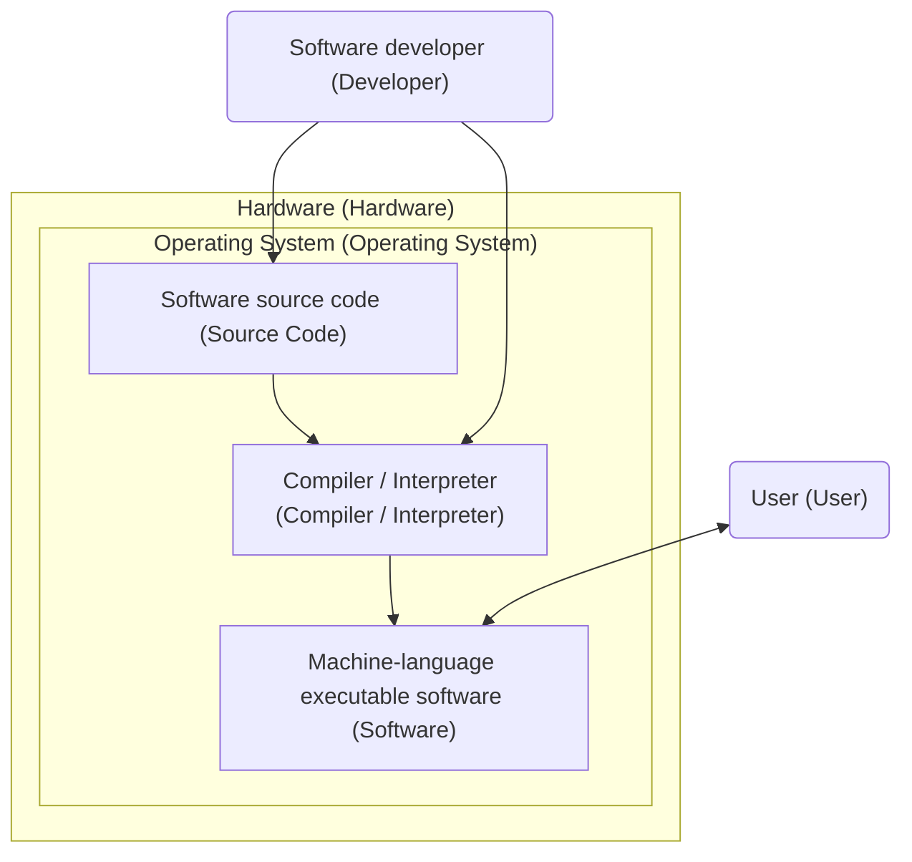
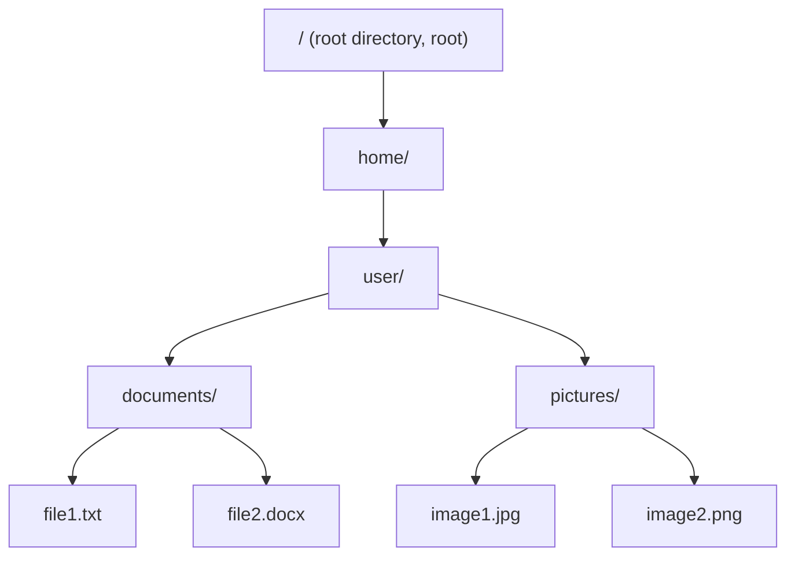

# Introduction to Programming - Development Environment and Tools

Welcome to Python programming at Metropolia University of Applied Sciences!

## Operating System

Before we begin actual programming, it is important to first understand how a computer works from the user's perspective. The computer's operating system (_operating system, OS_) plays a central role in this.

An operating system is software that acts as an intermediary between the user, programs, and the computer's hardware. Windows, macOS, and Linux are the most common operating systems, which ensure that programs can be started, files can be handled, and devices such as the keyboard and display work as expected with programs.

When writing and running a program written in, for example, the Python programming language, the operating system is responsible for starting the program and managing its execution.

- Software source code is what the programmer writes (e.g. Python code)
- A compiler or interpreter converts human-readable code into machine-language form that the computer's operating system can execute
- The operating system manages the execution of the program and provides an interface between the program, hardware, and user
- The hardware does the actual work (Processor (CPU), memory, storage space, etc.)

### File System

Within an operating system, all information is organized using a file system. A file system is a way of organizing and permanently storing data so that it can be found and handled logically. This can be thought of as a folder tree: there are folders that contain subfolders and files.

The structure of a file system varies depending on the operating system, but the basic principle is the same: all information is organized hierarchically into folders and files. Files are stored on the device's persistent storage (e.g. hard drive, USB flash drive, SSD), whose contents do not disappear even when the device is powered off.

A file itself is simply a stored collection of data. It can be an image, video, program, or a file containing text. A file name often consists of the actual name and an extension. An extension, such as `.docx`, `.xls`, or `.txt`, provides a clue about what the file contains and which program is typically used to handle it.

In Python programming, a developer generally saves source code as a `.py` file. In addition, Python programs can read and save various types of files, such as text, spreadsheets, and image files. File handling is a central part of programming, and therefore it is important to understand where files are located in the computer's file system and how they are referenced from a program.

Modern operating systems often hide file extensions by default in their file browsers and display only an icon as the file type. This can cause confusion. For example, a `document.pdf` file may appear only as `document`. Hiding file extensions is intended to make the file browser visually clearer, but from a software development perspective, file extensions are also essential and can be made visible when necessary in the file browser's settings.

When talking about the location of a file, the term path (_path_) is used. A path tells you which folders you need to go through to find a file. This is essential in programming because programs constantly read and write files, and they need to know exactly where the data is located.

For example, `C:\Users\username\documents\file1.txt` is a path that tells us that the `file1.txt` file is located in the `documents` folder, which in turn is in the `username` folder, which is in the `Users` folder on the C drive (Windows). On MacOS and Linux systems, paths look slightly different, for example `/home/username/documents/file1.txt`.

The examples above are called absolute paths because they start from the root directory (C:\ in Windows, and / in Linux and Mac). Relative paths are also often used in programming. They are defined relative to the program's current location. For example, `./data/file1.txt` means that the `file1.txt` file is located in the `data` folder, which is in the same folder as the program itself.

Although operating systems today support spaces, accented characters, and special characters in file names in addition to letters and numbers, it is good practice to avoid these in programming projects. In particular, spaces and special characters such as `!`, `@`, `#`, `$`, `%`, `^`, `&`, `*`, `(`, `)`, `{`, `}`, `[`, `]`, `|`, `\`, `/`, `:`, `;`, `"`, `'` and `< >` should be avoided because they can cause problems in different environments and tools. In general, it is good practice to use only letters, numbers, underscores (\_) and hyphens (-) in file names.

It is also worth remembering that a lowercase letter is different from the corresponding uppercase letter. For example, `file1.txt` and `File1.txt` are different files on many systems.

## Software Development Tools

In programming, source code files contain only plain text (_plain text_), which means content consisting solely of written characters without any text formatting, font settings, images, or page settings. Such files are generally referred to as text files, regardless of whether the content is program code, notes, or tabular data in CSV format.

Other types of files, such as PDFs, images, videos, etc., which require a special program to handle them, are generally referred to as [binary files](https://en.wikipedia.org/wiki/Binary_file).

In principle, any text editor that can be used to write code is sufficient for creating software. In addition, either a compiler (_compiler_), which compiles source code into a program that can run on the operating system, or an interpreter (_interpreter_), which translates source code into machine language "on the fly", is required. Which one is used generally depends on the chosen programming language.

There are also many auxiliary tools to make software development easier, for example for automatic code completion and formatting, syntax highlighting, testing, finding errors, compiling into machine language, etc. When these features are combined with the actual editor in the same application, it is called an integrated development environment, or IDE (_Integrated Development Environment_).

The installation and use of the IDE are discussed in more detail in the [next section](01b_first_program_vscode.md).

### AI Assistants

Tools such as GitHub Copilot, Claude Code, and Cursor have become increasingly common as aids in software development in recent years. They use advanced language models to understand written code and provide suggestions for completing code and fixing errors. They can even be used to develop entire programs without understanding much about the programming language itself.

**When used correctly** AI assistants speed up programming and help developers find solutions to problems, but it is important to remember that they are not perfect and their suggestions should always be evaluated critically. A software developer must have sufficient expertise in how the software works to be able to professionally evaluate automatically generated code and distinguish unnecessary or incorrect code from appropriate code.

**The essential skills of a programmer can only be learned by coding yourself!**

In this course, programming is therefore primarily done without assistance provided by AI. Remember that in the exam, you will also have to write code independently without assistance.

## Version Control

The idea behind version control stems from an old problem: what happens when a file is edited and updated, but the old versions should not be destroyed? Without version control, confusing file names such as “raportti_final”, “raportti_final2”, and “raportti_oikeasti_final” can easily arise. Version control solves this by systematically keeping track of all changes without the need to constantly create new files.

Version control concepts are used in many everyday applications and services, such as Google Docs, [Wikipedia](https://fi.wikipedia.org/w/index.php?title=Versionhallinta&action=history), and Dropbox. These applications have version histories that record all changes made to a document. Users can view old versions, restore previous versions, or compare the differences between different versions.

Version control is particularly essential in software development because source code is constantly modified, and it is important to be able to track what changes have been made, who made them, when, and why. A version control system keeps track of all this information, which makes collaboration, tracing errors, and restoring previous versions when necessary easier.

Version control in software development is discussed in more detail [later](02a_version_control_and_git.md).

---

Next, we will install an IDE and code our [first program](01b_first_program_vscode.md).

---

<!-- add mermaid support for gh pages -->

