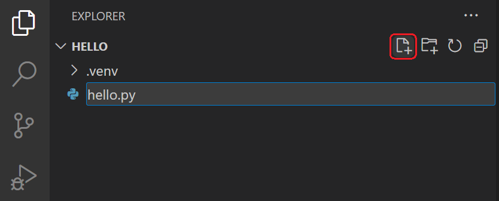
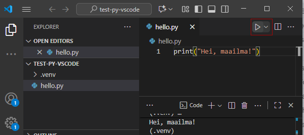

# First Program

```python
print("Welcome to learning Python!")
```

[Python](https://www.python.org/) is one of the world's most widely used programming languages. When you study Python, you can:

- learn programming easily and enjoyably
- code with high-quality and ergonomic development tools
- create impressive graphics using visualization libraries
- apply artificial intelligence thanks to comprehensive machine learning libraries

During your first year of study, you will acquire solid basic Python programming skills. You will deepen your knowledge in later studies and learn to use Python as a tool in programming and software development projects.

In this first module, you will install Python development tools and learn to write and run your first Python program.

## Installing the Python Programming Environment

The first task is to install a programming environment consisting of the Python interpreter and a code editor with extensions (integrated development environment). This course uses [Visual Studio Code](https://code.visualstudio.com/). The development environment is also referred to by the English abbreviation IDE, which stands for _Integrated Development Environment_. It means professional software that allows you to write, run, and test programs.

### Installing the Python Interpreter

The Python interpreter is a program that translates Python-language statements one statement at a time into a form understood by the computer's processor, that is, machine language. Installing it is necessary in order to program with Python.

1. Open the page [https://www.python.org/downloads/](https://www.python.org/downloads/) in a browser.
2. Download the latest version (3.x.x) of Python for your operating system (Windows, MacOS) and start the installer.
3. Proceed according to the instructions provided by the installation wizard and install Python in the default location suggested by the installer.
   - Select the "_Add Python to PATH_" option in the installation window so that Python can also be easily found from the command line when necessary.

**Important:** The installation wizard provides the option to add the Python interpreter to the `PATH` environment variable in the Windows operating system. This environment variable contains a list of folders from which the operating system automatically searches for executable programs. It is worth adding Python to it: this allows you to enter the command `python` (or `python3`) in the command window from any folder, and the Python interpreter will be found automatically. (This will be useful in the upcoming Hardware 1 and 2 courses, where Python will also be used.)

The following image shows the selection box where this can be enabled:


### Installing the Development Environment

1. Download and install [Visual Studio Code](https://code.visualstudio.com/).
2. After the installation, open Visual Studio Code and install the [Python extension](https://marketplace.visualstudio.com/items?itemName=ms-python.python).

The programming environment is installed according to [these instructions](https://code.visualstudio.com/docs/python/python-tutorial).

### Creating the First Programming Project and Python File

You are now ready to write your first program. First, a project needs to be created. A project can be thought of as a kind of portfolio where programs related to the same topic are collected. For example, for your first programming experiments, you can create a new project called `python-exercises`. In practice, a project is a **folder** dedicated to this purpose in the computer's operating system file system, where all program files and any other files the program needs to function are collected.

Create a new folder for the project. You can create the folder, for example, on the desktop or in your documents. Name the folder `python-exercises`. Open the created folder in Visual Studio Code. You can do this by selecting **File / Open Folder** and then selecting the folder you created.

Open the _Command Palette_ by pressing `Ctrl+Shift+P` (Windows) or `Cmd+Shift+P` (MacOS). Enter `Python: Create Environment` in the field that opens and select it. Then select `Venv` as the environment type and press Enter. Finally, select the location of the Python interpreter (the most recently installed version), if prompted.

A new project is created by creating a Python virtual environment (venv). This makes it easier to manage the Python packages used by your own programs and their versions.

The virtual environment is created inside the project folder in a folder named `.venv`. You can see the contents of your project folder in the file explorer (Explorer) on the left.

> **Note:** If you later change the name of the project folder or move the folder to another location, the virtual environment may no longer work correctly. In this case, you can delete the `.venv` folder and create the virtual environment again as described above. You will then need to reinstall all external packages required by the project (discussed later).

Each program is written in a file inside the project's folder hierarchy. You can create a new file for the first program by clicking the icon next to the name of the project folder:



Name the file, for example, `hello.py` and press Enter. Python programs are written in files with the `.py` extension.

## Writing, Saving, and Running a Program

A program, that is, Python source code, is written in the editor:

```python
print("Hello, world!")
```

Save the file by pressing `Ctrl+S` (Windows) or `Cmd+S` (MacOS). You can now execute, or run, the program by clicking the arrow icon above the editor:



The output appears in the console window at the bottom:

```output
Hello, world!
```

If there are errors in the program, don't worry! You will receive an error message that helps locate the error. After that, you can fix the program as many times as necessary and run it again each time.

Making errors is part of programming. It has been estimated that 80 percent of a professional programmer's working time is spent tracing and fixing errors. Learning also happens through making errors. When you determine the cause of an error and fix it, you have become a slightly better programmer.

## Project Structure for Programming Exercises

All upcoming programming exercises are done in the same project folder. Always create a separate subfolder inside the project folder for each module you study. `hello.py` was the exercise for the first module, so create a folder called `mod01` and move the `hello.py` file inside it.

Create a `readme.md` text file in the root of the exercise folder, where you list all the tasks you have completed as you complete them. Example contents:

```markdown
# Software 1 - Python exercises

**My Name**

## Module 1

I completed exercises 1 and 2.

## Module 2

I completed exercises 1, 2, and 3.

I completed exercise 4 partially, but the problem was calculating only the grams correctly.

## Module 3 and so on...

...
...
```

You can also save other code examples from lessons and your own notes in the exercise folder. At the end of the course, the folder structure should look like the following:

```txt
python-exercises
├── readme.md - list of the exercises you have completed (see above)
├── mod01
│   ├── hello.py
│   └── other examples and exercise files from module 1
├── mod02
│   └── examples and exercise code files from module 2
├── mod03
│   └── examples and exercise code files from module 3
├── and so on...
├── game project
│   ├── readme.md - project documentation
│   └── code for the programming project task and related exercises
└── .venv
```

---

[Next, we will learn how to use version control.](02a_version_control_and_git.md)

---
