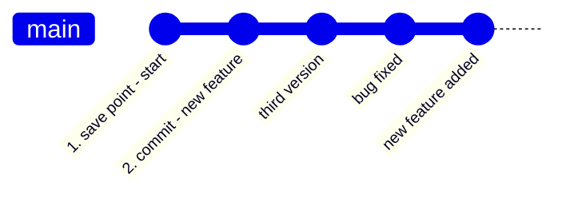
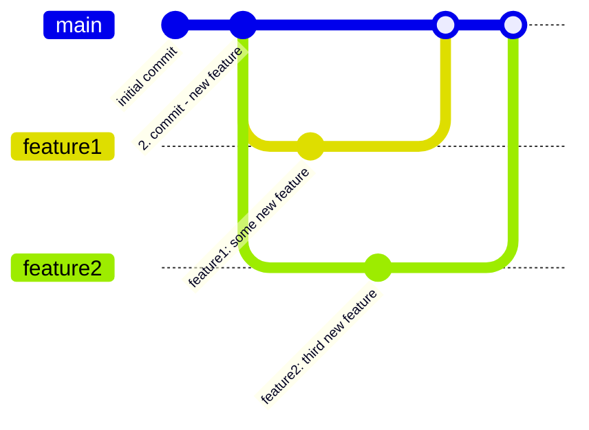
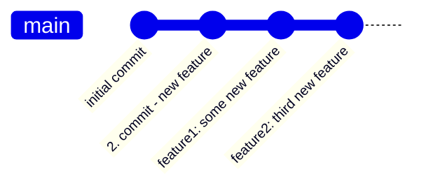
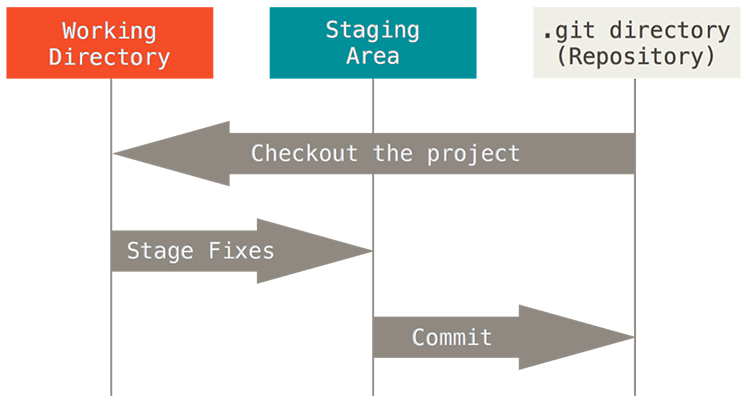
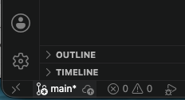

# Version Control

A version control system is an application that stores and manages different versions of a software project. Its key features and benefits include:

- Precise change tracking, which makes it possible to answer questions such as:
  - What has changed since the previous version?
  - Why was the change made?
  - When did it happen?
  - Who made it?

- Parallel development: makes it possible to develop several different features or fixes for the software simultaneously without developers interfering with each other's work.
- Efficient collaboration: makes it possible to share the project's code and its entire development history, which is essential for teamwork.
- Comparing and restoring versions: You can easily compare the current version with any previous version, track the progress of development, and, when necessary, return to older versions.
- Backup: Shared/distributed version control can also serve as a backup of the project, protecting the work from being lost.
- Ensuring code quality: The system plays a crucial role in maintaining code quality and keeping the development process running smoothly.

In practice, version control is an essential tool in professional software development. It is used by organizations and teams of all sizes to ensure effective project management.

There are several version control systems, the best known of which include Git, Subversion, and Mercurial. Of these, Git is currently the most common and widely used, and therefore in this section we will focus mainly on its use and operating principles, although many concepts are similar in other tools as well.

In practice, version control can be viewed as a timeline of software development, where changes made throughout the code are saved at appropriate intervals.



Save points are called "commit", "revision", or "version", depending somewhat on the system. The timeline is often called a development branch (_branch_), because in addition to the main branch (here "main"), there can be several other branches.

The folder where all work files, their versions, branches, and other version control metadata are stored is called a repository.

The following diagram illustrates a repository with several parallel development branches:



Here, new features have been developed based on a common starting point (commit), using parallel, independent branches. Finally, the developed features have been merged back into the main development branch. The version history of the main development branch then also contains all the changes (commits) made in separate development branches.

After this, the development branches could be deleted as unnecessary, because the main development branch already contains the entire history:



The joining of branches is referred to as _merge_. In practice, new development branches can be created based on any existing branch, and development branches can also be freely joined with one another.

If the branches being joined contain modifications to the same files such that the changes conflict with each other, a conflict (_conflict_) occurs. In this case, the developer performing the merge must go through the changes and resolve the conflicts in the code "manually" before the final merged version can be saved.

It is worth noting that a version control tool cannot independently guess how conflicting changes should be combined. This could easily lead to errors in the program's operation.

There are many partially automated tools (_merge tools_) to make resolving conflicts easier, but the developer who performed the branch merge is responsible for the final change. Conflicts occurring and resolving them is a completely natural part of software development teamwork.

The active development branch can be changed using the _checkout_ operation. In practice, this means that when a programmer switches to another development branch, the version control tool replaces the current work files in the project folder with the files from the selected version in the repository.

## Git

[git - the stupid content tracker](https://git.github.io/htmldocs/git.html) is, as its official name states, an open-source application intended for tracking changes to all kinds of content. Git can be used to version all types of files, but all features are available only when working with text files. The Git community's website and educational materials can be found at [https://git-scm.com/](https://git-scm.com/).

Originally, the application was developed by Linus Torvalds in 2005 for the needs of developing the Linux operating system, and it has since become a widely used version control system that is popular in both small and large software development projects.

Despite its name, the application is versatile, powerful, and designed with security in mind. Managing the application may initially seem challenging, but because it is a very important part of a software developer's toolkit, learning it is rewarding. We will use Git's basic functionality as needed throughout the courses.

Git is a distributed version control system, which means that each developer has their own copy of the entire project history, or repository, on their own computer, and Git is primarily used locally on the developer's own computer. A project managed with Git is therefore not dependent on any central server, although repositories are commonly shared through online services such as GitHub.

### Installation and Setup

[Download and installation options for different operating systems](https://git-scm.com/install/)

Installing and using Git in your own exercise project is done [in the next module](02b_setting_up_version_control_vscode.md).

### Basic Usage

Git is primarily a program run from the operating system's command line, meaning that it is used with text-based commands entered manually. There are also many tools with graphical user interfaces that use Git, and Git is integrated into practically all modern IDEs.

Using the command line requires some familiarization at first, but it helps you understand how Git works on a deeper level. If you are comfortable using Git commands, understanding and using graphical tools is also more logical.

A Git repository is created by running the `git init` command inside the folder where the entire programming project is located. This can also be done using the code editor's tool. In the following Git command examples, it is assumed that they are always executed in this same folder.

After this, the basic principle of Git's operation is that files have three different kinds of states or locations:


_[https://git-scm.com/book/en/v2/Getting-Started-What-is-Git](https://git-scm.com/book/en/v2/Getting-Started-What-is-Git)_

- Working directory (_working directory_): the folder where the developer works and where all the files of the programming project are located (the same folder where `git init` was executed). Files in the working directory can either be tracked by version control or be outside version control (see `.gitignore` below).
- Staging area: a temporary area where the developer selects the files (or their changes) that they want to save in the next save point (_commit_) in version control.
- Repository: the place where all commits are stored. The repository contains the entire history of the project, all commits, branches, and other version control metadata (the `.git/` folder).

The practical workflow is as simple as follows:

1. The developer develops the program, that is, creates/deletes and makes changes to files in the working directory.
2. The developer selects which changes they want to save in version control and adds them to the staging area with the [`git add`](https://www.geeksforgeeks.org/git/what-is-git-add/) command, either one file at a time using `git add <file(or list)>`, for example `git add main.py kissa.py`, or an entire folder at once: `git add .`.
   - Files that have been added to the staging area are ready to be saved in the next commit.
   - Not all changes need to be saved in the next version; the developer can choose which changes they want to save and which ones to leave unfinished in the working directory.

3. The developer saves the changes in the staging area to the repository (the `.git/` folder) by creating a new save point with the [`commit`](https://www.atlassian.com/git/tutorials/saving-changes/git-commit) command: `git commit -m "commit-message"`. The commit message describes as clearly as possible what changes the new save point contains.
4. The developer continues working by making new changes in the working directory and repeats the previous steps from the beginning as needed.

**Note:** You can always see the state of the repository with the `git status` command. You can use this, for example, between every command mentioned above to see what is happening in the repository.

If the developer does not want to modify the original code directly, but instead wants to continue development while keeping the original code and its version history intact, they can create a new development branch alongside it with the [`git branch`](https://www.atlassian.com/git/tutorials/using-branches) command, e.g. `git branch uusi-ominaisuus`.

The created development branch "uusi-ominaisuus" shares the same history, that is, all commits, with the main development branch (`main` (or `master`)). Switching to the new branch is done with the [`git checkout`](https://www.atlassian.com/git/tutorials/using-branches/git-checkout) command, e.g. `git checkout uusi-ominaisuus`. Creating and selecting the new branch can also be done with a single command, `git checkout -b uusi-ominaisuus`.

After this, all commits made are saved only to the new branch. You can return to the main development branch with the command `git checkout main`, at which point the work files are replaced with the files from the latest commit of the main development branch.

When the new feature developed in the development branch is ready, it can be merged back into the main development branch with the [`git merge`](https://www.atlassian.com/git/tutorials/using-branches/git-merge) command, e.g. `git merge uusi-ominaisuus`. This also saves all commits made in the new branch to the main development branch.

Branches can be merged with one another freely in any direction, and `git merge` merges the selected branch into whichever branch is currently active. That is, when you want to merge `uusi-ominaisuus` into the main branch `main`, you should first make sure that it is active (`git status` or `git checkout main`).

In the VS Code editor, creating and switching between branches is also easy through the Git tool in the lower-left corner, and using the command line is not necessary.



Creating separate development branches is not necessary in this course, but practicing already at this stage makes it easier to adopt this important tool in future courses.

Other useful Git commands include:

- [`git log`](https://www.geeksforgeeks.org/git/how-to-check-git-logs/): viewing the commit history (who, what, when), press the 'q' key when necessary to stop browsing
- [`git diff`](https://www.geeksforgeeks.org/git/git-diff/): comparing changes, for example between files in the working directory and files in the repository, or between two commits
- `git reset`: clearing the staging area, returning to a previous version, discarding new changes, use with caution!

Git is a very versatile tool, and necessary functions can and should also be searched for and learned independently as needed. In this course, we will only take a brief look at the most important features.

#### `.git/` folder

When a new repository is created (`git init`), a subfolder `.git/` is created in the project folder. This contains practically all information related to the version control of the project. The folder is a so-called hidden file, which by default is not visible in the operating system or the editor's file explorer. If the folder is deleted, everything related to version control is destroyed, and only the work files currently in the folder remain. The contents of the folder must also not be modified directly; all work with the repository is done using Git's various commands.

For example, when switching development branches (`git checkout <branchname>`), Git replaces the work files with the files from the latest save point of the selected development branch in the `.git/` folder.

Different Git tools (command line, editor functions, etc.) can safely be used side by side in the same project because they all operate by processing this same folder.

#### `.gitignore` file

Git tracks only those files that have been added to version control. Files that should not be tracked can be specified in the `.gitignore` file. This is a text file that is usually located at the root level of the project folder. The file contains a list of file paths or file names that should be excluded from version control.

As a general rule, everything that is not directly related to the program code is left outside version control. Such files and folders include, among other things:

- Compiled program files (e.g. `.exe`, `.pyc`) and other files automatically generated from source code.
- User-specific configuration files, such as IDE settings.
- Files containing passwords or other sensitive information.
- Large binary files (e.g. videos) that can be stored somewhere other than in version control.

For example, in a Python project, it is recommended to leave at least the virtual environment files outside version control, in which case the line `.venv/` is added to the `.gitignore` file. A typical Python project's `.gitignore` could look like this:

```gitignore
# Python cache files
__pycache__/
*.pyc
*.pyo
# Virtual environment
.venv/
# IDE settings
.vscode/
.idea/
# OS generated files
.DS_Store
Thumbs.db
```

`*` is a so-called wildcard, which means any string of characters. For example, `*.pyc` means all files with the `.pyc` extension.

---

## Additional Material for Studying Git

Below are a few useful links for those who are interested:

- [Atlassian: What is version control?](https://www.atlassian.com/git/tutorials/what-is-version-control)
- [Git videos](https://git-scm.com/videos)
- [Pro Git](http://git-scm.com/book/en/v2) - free book
- [Git Cheat Sheet](https://git-scm.com/cheat-sheet) - a collection of the most important commands

---

[Next, we will set up version control in your own exercise project](02b_setting_up_version_control_vscode.md).

---

<!-- add mermaid support for gh pages -->
<script type="module">
    Array.from(document.getElementsByClassName("language-mermaid")).forEach(element => {
      element.classList.add("mermaid");
    });
    import mermaid from 'https://cdn.jsdelivr.net/npm/mermaid@11/dist/mermaid.esm.min.mjs';
    mermaid.initialize({ startOnLoad: true });
</script>
