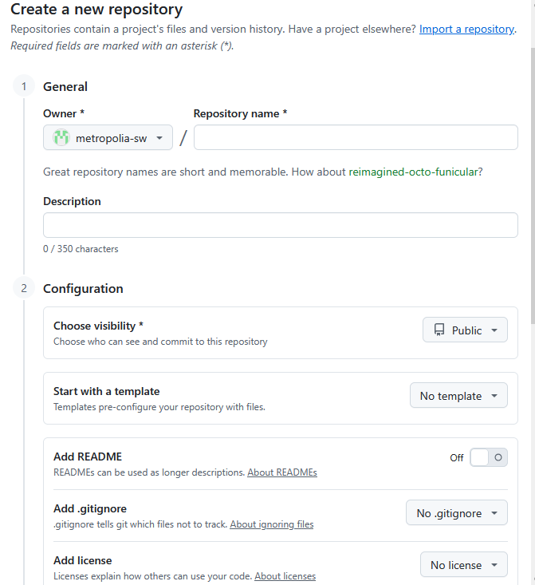
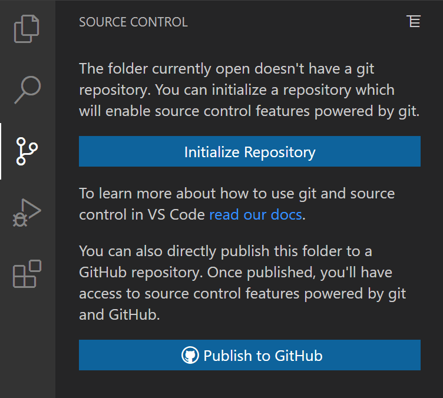
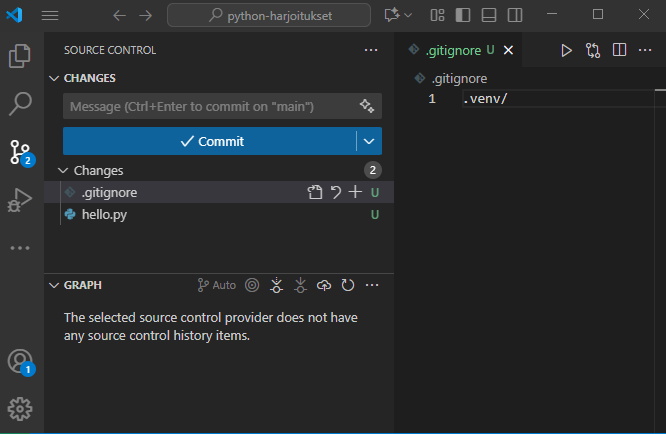
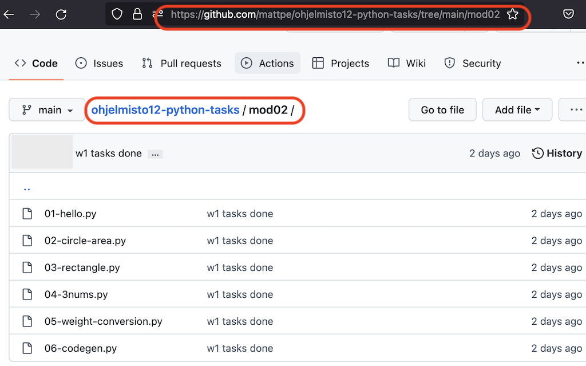
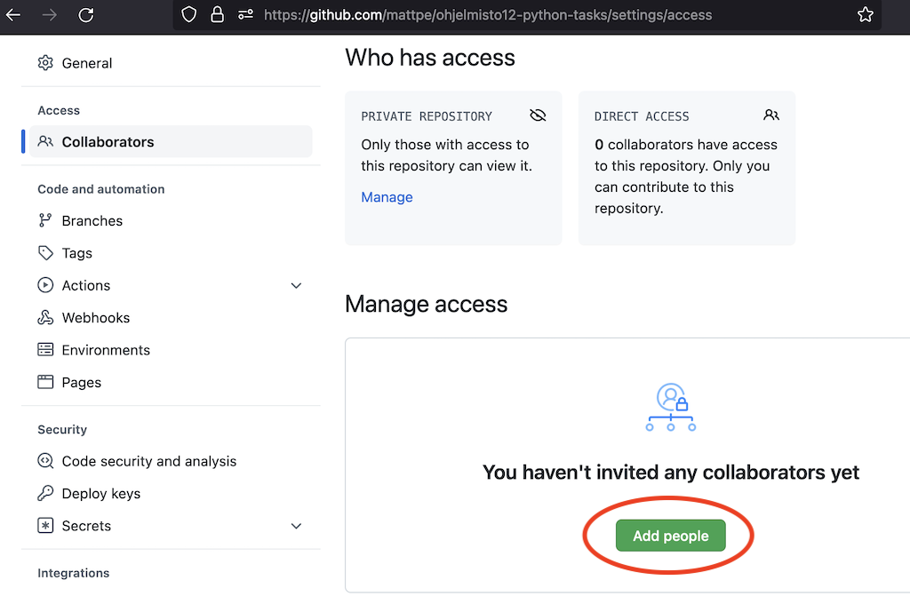

# Setting Up Version Control

Software is built step by step and piece by piece. Software is often developed as teamwork, and team members need to be able to access the same source code. Several versions of the source code are created during development, and sometimes there is a need to return to an earlier version. It is also important to ensure that once-written source code is not accidentally destroyed or lost.

For this purpose, version control is set up.

## Git and GitHub

In this course (and often in professional software development), a distributed version control system called Git is used. Distributed version control means that local copies of the shared storage location of the source code — that is, the repository — are created on the computers of the users of the version control system. The up-to-date information is often updated from the shared repository to the local repository on one's own computer when starting work (this is called _pull_). Changes made to the code are saved as a new version in the local repository (this is called _commit_) and can be updated back to the shared repository (this is called _push_).

The operating principles and use of Git were discussed in the previous [section](02a_version_control_and_git.md). Return to it whenever necessary.

GitHub is a website available to everyone where the source code (repository) of Git projects can be stored and shared. It is also the world's largest website developed for this purpose, and practically every professional in the software industry uses GitHub in one way or another.

To use GitHub, register as a user at <https://github.com/>.

Once you have created a user account on GitHub, you can create repositories, or storage locations for projects, there.

## Creating a Repository on GitHub

1. Register as a GitHub user at <https://github.com/>.
1. After logging in, press the **New** button next to the **Repositories** heading.
1. Create your own repository as shown in the image below and name it, for example, `python-exercises`.
1. Finally, press the **Create repository** button.

After this, the project in the VS Code editor needs to be connected to the GitHub project.

## Git and Visual Studio Code

Before you can use Git version control, you need to install the Git software on your computer. Download and install it from <https://git-scm.com/downloads> according to the instructions.

After installing Git, you can set it up for your Python project:

1. Open VS Code and open the project you want to connect to version control.
1. Open the terminal (Terminal) in the VS Code editor.
1. Set your username with the command `git config --global user.name "Firstname Lastname"`.
1. Set your email address with the command `git config --global user.email "email@metropolia.fi"`. The email address is the same one you used when registering with GitHub.
1. Create a `.gitignore` file in the project root. Add the line `.venv/` to the file so that the virtual environment files are not added to version control.
1. Initialize Git version control for the project and connect it to the GitHub repository by selecting the Git icon in the bar on the left (or pressing the keyboard shortcut `Ctrl+Shift+G`), and then pressing the **Publish to GitHub** button.

### Alternatively, you can also initialize the Git repository "manually" in the terminal

1. Initialize a new Git repository with the command `git init`.
1. Add the files to version control with the command `git add .`.
1. Make the first commit with the command `git commit -m "Initial commit"`.

After this, the local Git repository is ready, and you can connect it to the repository you created on GitHub. There are several different options for doing this:

- The simplest way to connect the local Git repository to the repository you created on GitHub is to use the built-in Git support in the VS Code editor.
  1. Open the Command Palette by pressing `Ctrl+Shift+P`.
  1. Enter `Publish to GitHub` in the field and select it.
  1. Follow the instructions.
- You can also use GitHub's own extension to log in through the VS Code editor.
  1. Install the extension by searching for it in the VS Code editor's extension manager (Extensions) using the name "GitHub Pull Requests".
  1. After installation, log in to your GitHub account through the extension by pressing the GitHub icon in the bar on the left.
- After logging in, you can also connect the local Git repository to the GitHub repository from the command line (terminal) as follows:
  1. Copy the URL (HTTPS) of the repository you created on GitHub.
  1. Add the remote repository with the command `git remote add origin <copied-URL>`.
  1. Push the contents of the local repository to GitHub with the command `git push -u origin main`.
     Log in to GitHub in the VS Code editor by selecting **Sign in to GitHub**. Follow the instructions.

## Using the Repository

At this stage, we will look at using GitHub from the perspective of a single developer. In this case, we can assume that different developers do not use the same files, and the problems caused by simultaneous editing do not occur. We also assume that there is no need for us to divide the development project into different development branches. It is worth becoming familiar with the advanced use of GitHub as a collaboration platform for a development team only later, when project work begins.

The VS Code editor has built-in Git support, which is worth using for the basic version control functions. They can be found behind the Git icon in the bar on the left side of the editor (or by pressing the keyboard shortcut `Ctrl+Shift+G`).

The following practices are worth adopting when working:

- When you start working, run the **Git / Pull** command. The command retrieves any changed information from the repository on GitHub.
- When you have produced new work, use the **Git / Add** function to select the files and changes you want to include in the next save point.
- Commit the changes using **Git / Commit**. The changes create a new save point that you can later return to if necessary. Always commit the changes no later than when you are finishing your work. It is a good idea to write a short description of the changes made in the commit message.
- When you finish working, run the **Git / Push** command. The command copies the committed changes on your local computer to the repository on GitHub.

You can examine the development branch and its save points on GitHub.

All source code, images, and other valuable files should be stored on GitHub. On the other hand, configuration files and other miscellaneous files related to the runtime environment should be left outside version control. Files containing passwords should also not be stored in version control for security reasons. The files to be excluded are listed in the `.gitignore` file stored in the project.

## Submitting Assignments Using GitHub

For assignments in Oma, always provide a direct link to the solution for the assignments in the relevant module. The easiest way to do this is to navigate to the correct folder in GitHub using a browser and copy the link directly from the browser's address bar. Name your Python files and folders so that it is immediately clear which assignment solutions they contain.

**If your repository is private:** For teachers to see your files on GitHub, you need to add the teachers' usernames as users to your GitHub project. This is done from the _Settings_ tab under _Collaborators_. The teachers' usernames are provided through the Oma workspace. Alternatively, you can change your project's visibility to public in the project settings.

---

[The actual programming begins in the next module.](03_variables_and_interactive_programs.md)

---
