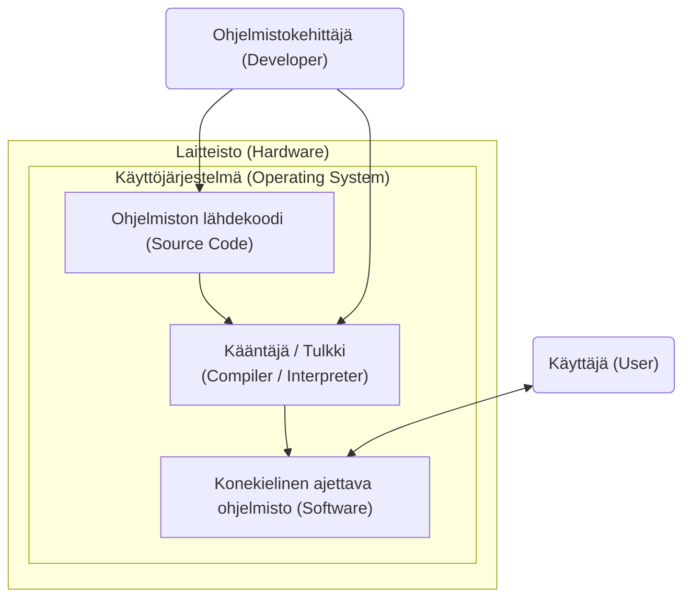
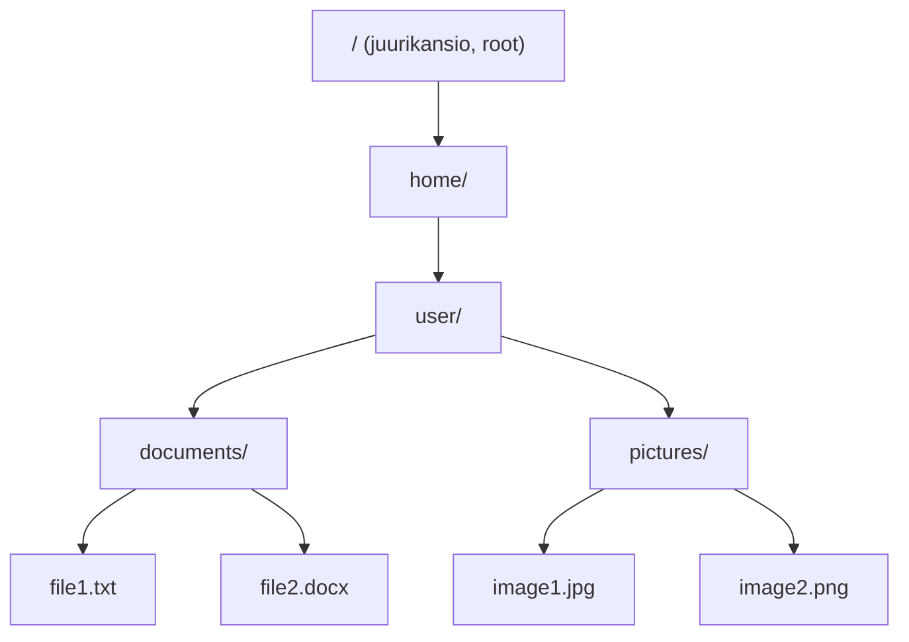

# Ohjelmoinnin aloitus - kehitysympäristö ja työkalut

Tervetuloa ohjelmoimaan Python-ohjelmointia Metropolia Ammattikorkeakoulussa!

## Käyttöjärjestelmä

Ennen kuin aloitetaan varsinainen ohjelmointi, on tärkeää ymmärtää ensin, miten tietokone toimii käyttäjän näkökulmasta. Tietokoneen käyttöjärjestelmällä (_operating system, OS_) on tässä keskeinen rooli.

Käyttöjärjestelmä on ohjelmisto, joka toimii välikerroksena käyttäjän, ohjelmien ja tietokoneen laitteiston välillä. Windows, macOS ja Linux ovat yleisimpiä käyttöjärjestelmiä, jotka huolehtivat siitä, että ohjelmat voidaan käynnistää, tiedostoja voidaan käsitellä ja laitteet, kuten näppäimistö ja näyttö, toimivat odotetusti ohjelmien kanssa.

Kun kirjoitetaan ja suoritetaan esimerkiksi Python-ohjelmointikielellä tehty ohjelma, käyttöjärjestelmä on se, joka käynnistää ohjelman ja hallitsee sen suoritusta.

- Ohjelmiston lähdekoodi on se, mitä ohjelmoija kirjoittaa (esim. Python-koodi)
- Kääntäjä tai tulkki muuntaa ihmiselle luettavan koodin konekieliseen muotoon, jota tietokoneen käyttöjärjestelmä voi suorittaa
- Käyttöjärjestelmä hallitsee ohjelman suoritusta ja tarjoaa rajapinnan ohjelman, laitteiston ja käyttäjän välille
- Laitteisto tekee varsinaisen työn (Prosessori (CPU), muisti, levytila jne.)

### Tiedostojärjestelmä

Käyttöjärjestelmän sisällä kaikki tieto on järjestetty tiedostojärjestelmän avulla. Tiedostojärjestelmä on tapa organisoida ja tallentaa tieto pysyvästi niin, että se löytyy ja sitä voidaan käsitellä loogisesti. Tätä voi ajatella kansiopuuna: on kansioita, joiden sisällä on alikansioita ja tiedostoja.

Tiedostojärjestelmän rakenne vaihtelee käyttöjärjestelmästä riippuen, mutta perusperiaate on sama: kaikki tieto on järjestetty hierarkkisesti kansioihin ja tiedostoihin. Tiedostot tallennetaan laitteen pysyvälle massamuistille (esim. kovalevy, muistitikku, SSD), jonka sisältö ei haihdu vaikka laitteesta sammutetaan virta.

Tiedosto itsessään on yksinkertaisesti tallennettu kokonaisuus dataa. Se voi olla kuva, video, ohjelma tai tekstiä sisältävä tiedosto. Tiedoston nimi koostuu usein varsinaisesta nimestä ja päätteestä. Pääte, kuten `.docx`, `.xls` tai `.txt`, antaa vihjeen siitä, mitä tiedosto sisältää ja millä ohjelmalla sitä yleensä käsitellään.

Python-ohjelmoinnissa kehittäjä tallentaa lähdekoodin yleisesti `.py`-tiedostona. Lisäksi Python-ohjelmat voivat lukea ja tallentaa erilaisia tiedostoja, kuten esimerkiksi tekstiä, taulukkoja ja kuvatiedostoja. Tiedostojen käsittely on keskeinen osa ohjelmointia, ja siksi on tärkeää ymmärtää, miten tiedostot sijaitsevat tietokoneen tiedostojärjestelmässä ja miten niihin viitataan ohjelmasta käsin.

Nykyaikaiset käyttöjärjestelmät usein oletuksena piilottavat tiedostopäätteen näkyvistä omissa tiedostoselaimissaan, ja näyttävät tiedoston tyypiksi vain kuvakkeen. Tämä voi aiheuttaa sekaannusta. Esimerkiksi `dokumentti.pdf`-tiedosto saattaa näkyä vain nimellä `dokumentti`. Tiedostopäätteen piilottaminen on tarkoitettu tekemään tiedostoselaimesta visuaalisesti selkeämpi, mutta ohjelmistokehityksen näkökulmasta myös tiedostopäätteet ovat oleellisia ja ne saa tarvittaessa näkyviin tiedostoselaimen asetuksista.

Kun puhutaan tiedoston sijainnista, käytetään käsitettä polku (_path_). Polku kertoo, mistä kansioista kulkemalla tiedosto löytyy. Tämä on ohjelmoinnissa keskeistä, koska ohjelmat lukevat ja kirjoittavat tiedostoja jatkuvasti, ja niiden täytyy tietää tarkalleen, mistä data löytyy.

Esimerkiksi `C:\Users\username\documents\file1.txt` on polku, joka kertoo, että `file1.txt`-tiedosto sijaitsee `documents`-kansiossa, joka puolestaan on `username`-kansiossa, joka on `Users`-kansiossa C-asemalla (Windows). MacOS- ja Linux-järjestelmissä polut näyttävät hieman erilaisilta, esimerkiksi `/home/username/documents/file1.txt`.

Yllä olevia esimerkkejä kutsutaan absoluuttisiksi poluiksi, koska ne alkavat juurikansiosta (Windowsissa C:\, Linuxissa ja Macissa /). Ohjelmoinnissa käytetään usein myös suhteellisia polkuja, jotka määritellään suhteessa ohjelman nykyiseen sijaintiin. Esimerkiksi `./data/file1.txt` tarkoittaa, että `file1.txt`-tiedosto sijaitsee `data`-kansiossa, joka on samassa kansiossa kuin ohjelma itse.

Vaikka käyttöjärjestelmät tukevat nykyään kirjainten ja numeroiden lisäksi välilyöntejä, ääkkösellisiä merkkejä ja erikoismerkkejä tiedostonimissä, on hyvä käytäntö välttää näitä ohjelmointiprojekteissa. Erityisesti välilyöntejä ja erikoismerkkejä, kuten `!`, `@`, `#`, `$`, `%`, `^`, `&`, `*`, `(`, `)`, `{`, `}`, `[`, `]`, `|`, `\`, `/`, `:`, `;`, `"`, `'` ja `< >` kannattaa välttää, koska ne voivat aiheuttaa ongelmia eri ympäristöissä ja työkaluissa. Yleisesti ottaen on hyvä käytäntö käyttää vain kirjaimia, numeroita, alaviivoja (\_) ja väliviivoja (-) tiedostojen nimissä.

Kannattaa muistaa myös, että pieni kirjain on eri merkki kuin vastaava iso kirjain. Esimerkiksi `file1.txt` ja `File1.txt` ovat eri tiedostoja monissa järjestelmissä.

## Ohjelmiston kehitystyökalut

Ohjelmoinnissa lähdekooditiedostot sisältävät vain puhdasta tekstiä (_plain text_), joka tarkoittaa pelkistä kirjoitusmerkeistä koostuvaa sisältöä ilman mitään tekstimuotoiluja, fonttimäärityksiä, kuvia tai sivun asetuksia. Tällaisista tiedostoista käytetään yleisnimitystä tekstitiedosto, oli sisältö sitten ohjelmakoodia, muistiinpanoja, tai vaika CSV-muotoista taulukoitua tietoa.

Muunlaisista tiedostoista, kuten PDF, kuvat, videot jne., jotka tarvitsevat erityisen ohjelman niiden käsittelyyn, käytetään yleisnimitystä [binääritiedosto](https://fi.wikipedia.org/wiki/Bin%C3%A4%C3%A4ritiedosto).

Ohjelmiston luomiseen riittää siis periaatteessa mikä tahansa tekstieditori, jolla voi kirjoittaa koodia. Lisäksi tarvitaan joko kääntäjä (_compiler_), jolla lähdekoodit käännetään käyttöjärjestelmässä toimivaksi ohjelmaksi tai tulkki (_interpreter_), joka kääntää lähdekoodia konekielelle ns. "lennossa". Se, kumpaa käytetään riippuu yleensä valitusta ohjelmointikielestä.

Ohjelmistokehitystä helpottamaan on olemassa myös paljon aputyökaluja liittyen esimerkiksi koodin automaattiseen täydentämiseen ja muotoiluun, värikorostukssin, testaamiseen, virheiden etsimiseen, kääntämiseen konekielelle jne. Kun nämä ominaisuudet on koottu varsinaisen editorin lisäksi samaan sovellukseen, puhutaan ohjelmistokehittimestä eli IDEstä (_Integrated Development Environment_).

Ohjelmistokehittimen asennusta ja käyttöä käsitellään tarkemmin [seuraavassa osassa](./01b_ensimmainen_ohjelma_vscode.md).

### Tekoälyavustimet

Työkalut, kuten GitHub Copilot, Claude Code ja Cursor ovat viime vuosina yleistyneet ohjelmistokehityksen apuvälineinä. Ne hyödyntävät kehittyneitä kielimalleja ymmärtääkseen kirjoitettua koodia ja tarjotakseen ehdotuksia koodin täydentämiseen ja virheiden korjaamiseen. Niillä voi jopa kehittää kokonaisia ohjelmia ymmärtämättä itse ohjelmointikielestä juuri mitään.

**Oikein käytettynä** tekoälyavustimet nopeuttavat ohjelmointia ja auttavat kehittäjiä löytämään ratkaisuja ongelmiin, mutta on tärkeää muistaa, että ne eivät ole täydellisiä ja niiden ehdotuksia tulee aina arvioida kriittisesti. Ohjelmistokehittäjällä on oltava riittävä asiantuntemus ohjelmiston toiminnasta, jotta hän kykenee arvioimaan automaattisesti generoitua koodia ammattimaisesti ja erottamaan tarpeettoman tai virheellisen koodin tarkoituksenmukaisesta.

**Välttämättömät ohjelmoijan taidot voit oppia vain itse koodaamalla!**

Tällä kurssilla ohjelmoidaan siis lähtökohtaisesti ilman tekoälyn tarjoamaa apua. Muista, että myös kokeessa joudut kirjoittamaan koodia itsenäisesti ilman apuja.

## Versionhallinta

Versionhallinnan idea lähtee vanhasta ongelmasta: mitä tapahtuu, kun tiedostoa muokataan ja päivitetään, mutta ei haluta tuhota kuitenkaan vanhoja versioita? Ilman versionhallintaa syntyy helposti sekavia tiedostonimiä kuten “raportti_final”, “raportti_final2” ja “raportti_oikeasti_final”. Versionhallinta ratkaisee tämän pitämällä kirjaa kaikista muutoksista järjestelmällisesti ilman tarvetta luoda aina uusia tiedostoja.

Versionhallinnan konsepteja hyödynnetään monissa arkisissa sovelluksissa ja palveluissa, kuten esim. Google Docsissa, [Wikipediassa](https://fi.wikipedia.org/w/index.php?title=Versionhallinta&action=history) ja Dropboxissa. Näissä sovelluksissa on versiohistoria, joka tallentaa kaikki dokumenttiin tehdyt muutokset. Käyttäjät voivat tarkastella vanhoja versioita, palauttaa aiempia versioita tai vertailla eri versioiden eroja.

Erityisesti ohjelmistokehityksessä versionhallinta on käytännössä välttämätöntä, koska ohjelmakoodia muokataan jatkuvasti, ja on tärkeää pystyä seuraamaan, mitä muutoksia on tehty, kuka ne on tehnyt, milloin ja miksi. Versionhallintajärjestelmä pitää kirjaa kaikista näistä tiedoista, mikä helpottaa yhteistyötä, virheiden jäljittämistä ja tarvittaessa vanhojen versioiden palauttamista.

Versionhallintaan ohjelmistokehityksessä perehdytään tarkemmin [myöhemmin](./02a_versionhallinta_ja_git.md).

---

Seuraavaksi asennetaan ohjelmistokehitin ja koodataan [ensimmäinen ohjelma](./01b_ensimmainen_ohjelma_vscode.md).

---

<!-- add mermaid support for gh pages -->

