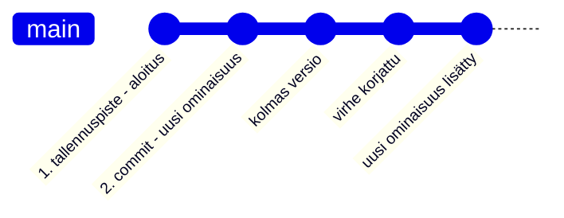
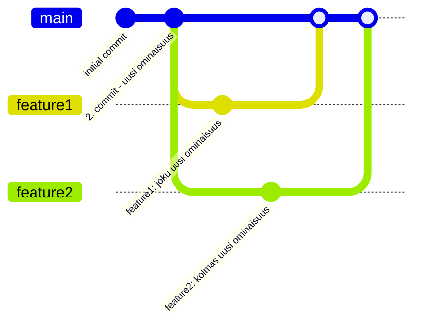
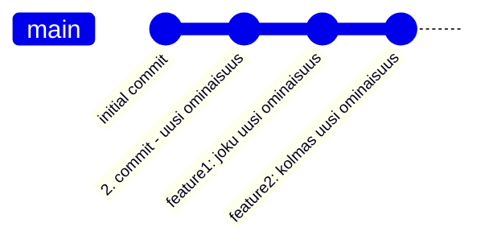

# Versionhallinta

Versionhallintajärjestelmä on sovellus, joka tallentaa ja hallitsee ohjelmistoprojektin eri versioita. Sen keskeisiä ominaisuuksia ja hyötyjä on mm.:

- Tarkka muutosseuranta, jonka avulla voi vastata kysymyksiin:
  - Mitä on muuttunut edellisestä versiosta?
  - Miksi muutos tehtiin?
  - Milloin se tapahtui?
  - Kuka sen teki?
- Rinnakkainen kehitystyö: mahdollistaa useiden eri ominaisuuksien tai korjausten kehittämisen ohjelmistoon samanaikaisesti ilman, että kehittäjät häiritsevät toistensa työtä.
- Tehokas yhteistyö: mahdollistaa projektin koodin ja sen koko kehityshistorian jakamisen, mikä on välttämätöntä tiimityössä.
- Versioiden vertailu ja palautus: Voit helposti vertailla nykyistä versiota mihin tahansa aiempaan versioon, seurata kehityksen kulkua ja tarvittaessa palata vanhoihin versioihin.
- Varmuuskopiointi: Jaettu/hajautettu versionhallinta voi toimia samalla myös projektin varmuuskopiona, suojaten työtä katoamiselta.
- Koodin laadun varmistaminen: Järjestelmä on ratkaisevassa roolissa koodin laadun ylläpitämisessä ja kehitysprosessin sujuvuudessa.

Käytännössä versionhallinta on välttämätön työkalu ammattimaisessa ohjelmistokehityksessä. Sitä käyttävät kaikenkokoiset organisaatiot ja tiimit varmistaakseen tehokkaan projektinhallinnan.

Versionhallintajärjestelmiä on useita, joista tunnetuimpia ovat Git, Subversion ja Mercurial. Näistä Git on nykyään yleisin ja laajimmin käytetty, ja siksi keskitymme tässä osiossa pääosin sen käyttöön ja toimintaperiaatteisiin, vaikka monet konseptit ovat samankaltaisia myös muissa työkaluissa.

Käytännössä versionhallinta voidaan nähdä ohjelmiston kehityksen aikajanana, johon tallennetaan kaikkialle koodiin tehtyjä muutoksia sopivin väliajoin.



Tallennuspisteitä kutsutaan nimillä "commit", "revision" tai "version" hieman järjestelmästä riippuen. Aikajanaa kutsutaan taas usein kehityshaaraksi (_branch_), koska haaroja voi olla päähaaran (tässä "main") lisäksi useita muitakin.

Kansiota, johon kaikki työtiedostot, niiden versiot, haarat ja muut versionhallinnan metatiedot on tallennettu, kutsutaan tietovarastoksi tai yleisemmin puhekielessä repositorioksi.

Seuraavassa kaaviossa havannoillistetaan repositoriota jossa on useampi rinnakkainen kehityshaara:



Tässä uusia ominaisuuksia on kehitetty yhteisen lähtökohdan (commit) pohjalle käyttäen rinnakkaisia toisistaan riippumattomia haaroja. Lopuksi kehitetyt ominaisuudet on liitetty takaisin osaksi pääkehityshaaraa. Tällöin pääkehityshaaran versiohistoriaan sisältyvät myös kaikki erillisissä kehityshaaroissa tehdyt muutokset (commit).

Tämän jälkeen kehityshaarat voitaisiin tarpeettomina poistaa, koska pääkehityshaara sisältää jo koko historian:



Haarojen yhteenliittämisestä käytetään termiä _merge_. Käytännössä uusia kehityshaaroja voi luoda minkä tahan olemassa olevan haaran pohjalta, ja kehityshaaroja voi myös liittää toisiinsa vapaasti.

Jos yhteenliitettävissä haaroissa on muokattu samoja tiedostoja siten, että muutokset ovat keskenään ristiriidassa, syntyy konflikti (_conflict_). Tällöin kehittäjän, joka liittämisen tekee täytyy käydä muutokset läpi ja ratkaista ristiriidat koodista "käsin" ennen kuin lopullinen yhteenliitetty versio voidaan tallentaa.

On huomionarvoista, että versionhallintatyökalu ei kykene itsenäisesti arvaamaan, miten ristiriidassa olevat muutokset tulisi yhdistää. Tämä voisi johtaa helposti virheisiin ohjelman toiminnassa.

Konfliktien ratkaisemisen helpottamiseksi löytyy monia osin automatisoituja työkaluja (_merge tools_), mutta viimeisimmästä muutoksesta on vastuussa haarojen liitokset tehnyt kehittäjä. Konfliktien syntyminen ja ratkominen on täysin luonnollinen osa ohjelmistokehityksen tiimityötä.

Aktiivista kehityshaaraa voi vaihtaa _checkout_-toiminnolla. Käytännössä tämä tarkoittaa sitä, että kun koodari vaihtaa toiseen kehityshaaraan, versionhallintatyökalu korvaa projektikansiossa olevat nykyiset työtiedostot valitun version tiedostoilla repositoriosta.

## Git

[git - the stupid content tracker](https://git.github.io/htmldocs/git.html) on virallisen nimensä mukaisesti kaikenlaisen sisällön muutosten seurantaan tarkoitettu avoimen lähdekoodin sovellus. Gitin avulla voi versioida kaikentyyppisiä tiedostoja, mutta kaikki ominaisuudet ovat käytössä vain tekstitiedostaja käsitellessä. Git-yhteisön ylläpitämät kotisivut opetusmateriaaleineen löytyvät osoitteesta <https://git-scm.com/>.

Alunperin sovelluksen kehittämisen aloitti vuonna 2005 Linus Torvalds Linux-käyttöjärjestelmän kehityksen tarpeisiin ja se on sittemmin noussut yleisesti käytetyksi versionhallintajärjestelmäksi, joka on suosittu niin pienissä kuin suurissakin ohjelmistokehitysprojekteissa.

Nimestään huolimatta sovellus on monipuolinen, tehokas ja tietoturvalliseksi suunniteltu. Sovelluksen hallinta saattaa alkuun tuntua haastavalta, mutta koska kyseessä on erittäin tärkeä osa ohjelmistokehittäjän työkalupakkia, sen opettelu palkitsee. Käytämme gitin perustoiminnallisuuksia tarpeen mukaan läpi opintojaksojen.

Git on hajautettu versionhallintajärjestelmä, mikä tarkoittaa, että jokaisella kehittäjällä on oma kopio koko projektin historiasta eli repositoriosta omalla koneellaan ja gittiä käytetään ensisijaisesti paikallisesti omalla koneella. Gitin avulla hallinnoitu projekti ei ole siis riippuvainen mistään keskuspalvelimesta, vaikka yleisesti repositoriota jaetaankin verkkopalveluiden, kuten GitHub välityksellä.

### Asennus ja käyttöönotto

[Lataus- ja asennusvaihtoehdot eri käyttöjärjestelmille](https://git-scm.com/install/)

Gitin asentaminen ja käyttö omassa harjoitusprojektissa tehdään [seuraavassa moduulissa](02b_versionhallinnan_kayttoonotto_vscode.md).

### Peruskäyttö

Git on lähtökohtaisesti käyttöjärjestelmän komentoriviltä ajettava ohjelma, eli sitä käytetään käsin kirjoitettavilla tekstipohjaisilla komennoilla. Lisäksi löytyy monia gittiä käyttäviä graafisella käyttöliittymällä varustettuja työkaluja, ja git on integroitu myös käytännössä kaikkiin moderneihin IDEihin.

Komentorivin käyttö vaatii alkuun hieman perehtymistä, mutta auttaa ymmärtämään Gitin toimintaa syvällisemmin. Jos git-komentojen käyttö on hallussa, on myös graafisten työkalujen toiminnan ymmärtäminen ja käyttö loogisempaa.

Git repositorio luodaan ajamalla `git init` -komento sen kansion sisällä, jossa koko ohjelmointiprojekti sijaitsee. Tämä voidaan tehdä myös koodieditorin työkalulla. Jatkossa git-komentoesimerkeissä oletetaan, että ne suoritetaan aina tässä samassa kansiossa.

Tämän jälkeen Gitin toiminnan perusperiaate on, että tiedostoilla on kolme eräänlaista tilaa tai paikkaa:


*https://git-scm.com/book/en/v2/Getting-Started-What-is-Git*

- Työtila (_working directory_): kansio, jossa kehittäjä työskentelee ja jossa kaikki ohjelmointiprojektin tiedostot sijaitsevat (sama kansio, jossa `git init` suoritettiin). Työtilassa olevat tiedostot voivat olla joko versionhallinnan seurannassa tai seurannan ulkopuolella (katso `.gitignore` alempaa).
- Staging area: väliaikainen alue, johon kehittäjä valitsee tiedostot (tai niiden muutokset), jotka haluaa tallentaa versionhallinnan seuraavaan tallennuspisteeseen (_commit_).
- Repositorio: paikka, johon kaikki commitit tallennetaan. Repositorio sisältää koko projektin historian, kaikki commitit, haarat ja muut versionhallinnan metatiedot (`.git/`-kansio).

Käytännön työnkulku etenee yksinkertaisimmillaan seuraavasti:

1. Kehittäjä kehittää ohjelmaa, eli luo/poistaa ja tekee muutoksia tiedostoihin työtilassa.
1. Kehittäjä valitsee, mitkä muutokset haluaa tallentaa versionhallintaan, ja lisää ne staging area:lle komennolla [`git add`](https://www.geeksforgeeks.org/git/what-is-git-add/) joko tiedosto kerrallaan `git add <tiedosto(tai lista)>`, esimerkiksi `git add main.py kissa.py` tai vaikka koko kansio kerralla: `git add .`.
   - Tiedostot, jotka on lisätty staging area:lle, ovat valmiina tallennettavaksi seuraavaan committiin.
   - Kaikkia muutoksia ei tarvitse tallentaa seuraavaan versioon, vaan kehittäjä voi valita, mitkä muutokset haluaa tallentaa ja mitkä jättää vielä keskeneräisinä työtilaan.
1. Kehittäjä tallentaa staging area:lla olevat muutokset repositorioon (`.git/`-kansio) luomalla uuden tallennuspisteen [`commit`](https://www.atlassian.com/git/tutorials/saving-changes/git-commit)-komennolla: `git commit -m "commit-viesti"`. Commit-viestissä kuvataan mahdollisimman selkeästi, mitä muutoksia uusi tallennuspiste sisältää.
1. Kehittäjä jatkaa työskentelyä tekemällä uusia muutoksia työtilassa, ja toistaa edelliset vaiheet alusta asti tarpeen mukaan.

**Huom:** Näet aina repositorion tilanteen `git status` -komennolla. Tätä voi käyttää vaikka jokaisen edellä mainittuun komennon välissä, jotta näkee mitä repositoriossa on tapahtumassa.

Jos kehittäjä ei halua muokata alkuperäistä koodia suoraan, vaan jatkaa kehittämistä säästäen alkuperäisen koodin versiohistorioineen koskemattomana, hän voi luoda rinnalle uuden kehityshaaran komennolla [`git branch`](https://www.atlassian.com/git/tutorials/using-branches), esim. `git branch uusi-ominaisuus`.

Luotu kehityshaara "uusi-ominaisuus" jakaa saman historian eli kaikki commitit pääkehityshaaran (`main` (tai `master`)) kanssa. Uuteen haaraan siirtyminen tapahtuu komennolla [`git checkout`](https://www.atlassian.com/git/tutorials/using-branches/git-checkout), esim. `git checkout uusi-ominaisuus`. Uuden haaran luomisen ja valitsemisen voi tehdä myös yhdellä komennolla `git checkout -b uusi-ominaisuus`.

Tämän jälkeen kaikki tehdyt commitit tallentuvat vain uuteen haaraan. Takaisin pääkehityshaaraan pääsee komennolla `git checkout main`, jolloin työtiedostot korvataan pääkehityshaaran viimeisimmän commitin tiedostoilla.

Kun kehityshaarassa kehitetty uusi ominaisuus on valmis, se voidaan liittää takaisin pääkehityshaaraan komennolla [`git merge`](https://www.atlassian.com/git/tutorials/using-branches/git-merge), esim. `git merge uusi-ominaisuus`. Tällöin pääkehityshaaraan tallentuvat myös kaikki ne commitit, jotka on tehty uudessa haarassa.

Haaroja voidaan liittää toisiinsa ristiin rastiin vapaasti, ja `git merge` liittää valitun haaran siihen haaraan, joka on aktiivisena. Eli kun halutaan liittää `uusi-ominaisuus` päähaaraan `main`, kannattaa ensin varmistaa, että se on aktiivinen (`git status` tai `git checkout main`).

VS Code -editorissa haarojen luominen ja vaihtaminen onnistuu helposti myös vasemman alalaidan Git-työkalun kautta, eikä komentorivin käyttö ole välttämätöntä.


Erillisten kehityshaarojen luominen ei ole tällä opintojaksolla välttämätöntä, mutta harjoitteleminen jo tässä vaiheessa helpottaa tärkeän työkalun omaksumista tulevilla kursseilla.

Muita käteviä Git-komentoja ovat mm.:

- [`git log`](https://www.geeksforgeeks.org/git/how-to-check-git-logs/): commit-historian tarkastelu (kuka, mitä, milloin), paina tarvittaessa 'q'-näppäintä lopettaaksesi selaamisen
- [`git diff`](https://www.geeksforgeeks.org/git/git-diff/): muutosten vertailu, esimerkiksi työtilassa olevien tiedostojen ja repositoriossa olevien tiedostojen välillä, tai kahden commitin välillä
- `git reset`: staging arean tyhjentäminen, paluu aiempaan versioon, uusien muutosten hylkääminen, käytä harkiten!

Git on todella monipuolinen työkalu ja tarpeellisia toimintoja voi ja kannattaa etsiä ja opetella tarpeen mukaan itsekin. Tällä jaksolla otetaan vain pintaraapaisu tärkeimpiin ominaisuuksiin.

#### `.git/`-kansio

Kun uusi repositorio luodaan (`git init`), syntyy projektikansioon alikansio `.git/`. Tämä sisältää käytännössä kaiken projektin versionhallintaan liittyvän tiedon. Kansio on niin sanottu piilotiedosto, joka ei oletusasetuksilla näy käyttöjärjestelmän, eikä editorin tiedostoselaimessa. Jos kansion poistaa, tuhoutuu kaikki versionhallintaan liittyvä ja jäljelle jää vain sillä hetkelle kansiossa olevat työtiedostot. Kansion sisältöä ei saa myöskään muokata suoraan, vaan kaikki repositorion kanssa työskentely tapahtuu gitin eri komennoilla.

Esimerkiksi kehityshaaraa vaihdettaessa (`git checkout <branchname>`) git korvaa työtiedostot `.git/`-kansiosta valitun kehityshaaran tuoreimman tallennuspisteen tiedostoilla.

Eri git-työkaluja (komentorivi, editorin toiminnot, jne.) voi huoletta käyttää samassa projektissa rinnakkain, koska ne kaikki operoivat käsittelemällä tätä samaa kansiota.

#### `.gitignore`-tiedosto

Git seuraa vain niitä tiedostoja, jotka on lisätty versionhallintaan. Tiedostot, joita ei haluta seurata, voidaan määritellä `.gitignore`-tiedostossa. Tämä on tekstitiedosto, joka sijaitsee yleensä projektikansion juuritasolla. Tiedostoon kirjoitetaan lista tiedostopolkuja tai tiedostonimiä, jotka halutaan jättää versionhallinnan ulkopuolelle.

Pääsääntöisesti versionhallinnan ulkopuolelle jätetään kaikki, mikä ei liity suoraan ohjelmakoodiin. Tällaisia tiedostoja ja kansioita ovat muun muassa:

- Käännetyt ohjelmatiedostot (esim. `.exe`, `.pyc`), ja muut automaattisesti lähdekoodista generoituvat tiedostot.
- Käyttäjäkohtaiset konfiguraatiotiedostot, kuten IDE:n asetukset.
- Salasanoja tai muita arkaluontoisia tietoja sisältävät tiedostot.
- Suuret binääritiedostot (esim. videot), jotka voidaan tallentaa muualle kuin versionhallintaan.

Esimerkiksi Python-projektissa on suositeltavaa jättää ainakin virtuaaliympäristön tiedostot versionhallinnan ulkopuolelle, jolloin `.gitignore`-tiedostoon lisätään rivi `.venv/`. Tyypillinen Python-projektin `.gitignore` voisi näyttää seuraavalta:

```gitignore
# Python cache files
__pycache__/
*.pyc
*.pyo
# Virtual environment
.venv/
# IDE settings
.vscode/
.idea/
# OS generated files
.DS_Store
Thumbs.db
```

`*` on niin sanottu jokerimerkki, joka tarkoittaa mitä tahansa merkkijonoa. Esimerkiksi `*.pyc` tarkoittaa kaikkia `.pyc`-päätteisiä tiedostoja.

---

## Lisämateriaalia Gitin opiskeluun

Alle on poimittu muutamia hyödyllisiä linkkejä kiinnostuneille:

- [Atlassian: What is version control?](https://www.atlassian.com/git/tutorials/what-is-version-control)
- [Git videot](https://git-scm.com/videos)
- [Pro Git](http://git-scm.com/book/en/v2) - ilmainen kirja
- [Git Cheat Sheet](https://git-scm.com/cheat-sheet) - kooste tärkeimmistä komennoista

---

[Seuraavaksi otetaan versionhallinta käyttöön omassa harjoitusprojektissa](02b_versionhallinnan_kayttoonotto_vscode.md).

---

<!-- add mermaid support for gh pages -->
<script type="module">
    Array.from(document.getElementsByClassName("language-mermaid")).forEach(element => {
      element.classList.add("mermaid");
    });
    import mermaid from 'https://cdn.jsdelivr.net/npm/mermaid@11/dist/mermaid.esm.min.mjs';
    mermaid.initialize({ startOnLoad: true });
</script>
