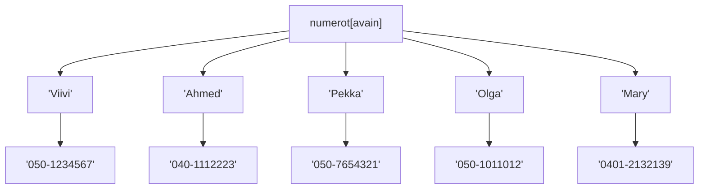
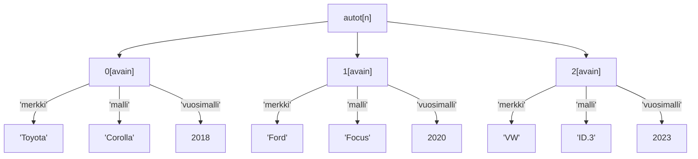

# Monikko, joukko ja sanakirja

Aiemmin käsiteltiin Python-kielen listarakennetta, joka on kielen tarjoamista tietorakenteista yleisimmin käytetty. Python-kieli tarjoaa myös kolme muuta sisäänrakennettua tietorakennetta, joista kullakin on oma käyttöalueensa.

Tässä moduulissa opit käyttämään näitä kolmea Pythonin tietorakennetta: monikkoa, joukkoa ja sanakirjaa.

## Monikko

Monikko (_tuple_) muistuttaa Pythonin listarakennetta siinä mielessä, että siinä voidaan esittää järjestetty jono alkioita. Toisin kuin lista, monikko on kuitenkin muuttumaton: siihen ei voi lisätä alkioita eikä siitä voi poistaa alkioita monikon luonnin jälkeen.

Monikkoa on tarkoituksenmukaista käyttää tilanteissa, joissa alkioiden jono on luonteeltaan staattinen: tiedetään, että muutoksille ei ole tarvetta ohjelman suorituksen aikana. Monikon käytön edut liittyvät muistinhallintaan: monikolle voidaan varata sitä luotaessa kiinteä muistialue, ja yksittäisen alkion osoite keskusmuistissa voidaan laskea suoraan tietorakenteen alkuosoitteen ja indeksin avulla. Listan tapauksessa tämä ei ole mahdollista, vaan haettaessa alkiota indeksin perusteella ajoympäristö joutuu yleensä iteroimaan alkiot lävitse. Ero näkyy siten, että alkion haku indeksin perusteella on monikon tapauksessa nopeampaa. Käytännössä ero on huomaamaton silloin, kun tietorakenne on pieni.

Katsotaan esimerkkiä monikon käytöstä. Seuraava ohjelma luo monikon viikonpäivien nimistä. Ohjelma kysyy käyttäjältä viikonpäivän järjestysnumeron ja tulostaa sitä vastaavan viikonpäivän nimen. Huomaa, että monikon indeksointi alkaa nollasta samoin kuin listan:

```python
viikonpaivat = ("maanantai", "tiistai", "keskiviikko", "torstai", "perjantai", "lauantai", "sunnuntai")
jarjestysnumero = int(input("Anna viikonpäivän järjestysnumero (1-7): "))
viikonpaiva = viikonpaivat[jarjestysnumero - 1]
print(f"{jarjestysnumero}. viikonpäivä on {viikonpaiva}.")
```

Ohjelma toimii ajettaessa näin:

```monospace
Anna viikonpäivän järjestysnumero (1-7): 3
3. viikonpäivä on keskiviikko.
```

Edellisessä esimerkissä monikon lueteltujen alkioiden ympärillä on kaarisulkeet. Kaarisulkeiden käyttö ei yleensä ole välttämätöntä, vaan monikko voidaan myös kirjoittaa ilman niitä. Seuraavan ohjelma luo ja tulostaa monikon, joka sisältää kolme merkkijonoa:

```python
hedelmat = "Appelsiini", "Banaani", "Omena"
print(hedelmat)
```

Ohjelma tulostaa:

```monospace
('Appelsiini', 'Banaani', 'Omena')
```

Kaarisulkeiden käyttö voi tulla pakolliseksi tilanteessa, jossa monikko on toisen tietorakenteen sisällä. Esimerkiksi sijoituslauseessa `arvot = 1, (2, 3), 4` kaarisulkeet ilmaisevat, että `arvot`-muuttujaan sijoitettavan monikon toinen alkio on itsessään monikko.

Vaikka kaarisulkeiden käyttö monikkojen yhteydessä ei yleensä ole välttämätöntä, monet Python-kehittäjät pitävät sitä hyvänä ohjelmointikäytäntönä, joka parantaa koodin luettavuutta.

### Monikon arvojen purku muuttujiin

Monikon sisältämät arvot voidaan purkaa muuttujiin seuraavan esimerkin osoittamalla tavalla:

```python
hedelmät = ("Appelsiini", "Banaani", "Omena")
(eka, toka, kolmas) = hedelmät
print(f"Hedelmiä ovat {eka}, {toka} ja {kolmas}.")
```

Tämä ohjelma tuottaa seuraavan tulosteen:

```monospace
Hedelmiä ovat Appelsiini, Banaani ja Omena.
```

### Monikko funktion paluuarvona

Aiemmin käsittelimme funktioita, joilla tarkoitetaan tarvittaessa kutsuttavia aliohjelmia. Monikkojen avulla voidaan helposti kiertää sitä rajoitetta, että funktiolla voi olla vain yksi paluuarvo: Jos arvoja halutaan palauttaa kaksi, rakennetaan niistä monikko ja palautetaan se paluuarvona. Teknisesti paluuarvoja on edelleen yksi, mutta se on tyypiltään monikko, joka voi sisältää useamman kuin yhden arvon.

Seuraava esimerkki havainnollistaa monikon käyttöä paluuarvona. Ohjelmassa tehdään nopanheittofunktio Monopoli-lautapeliä varten. Monopoli-pelissä heitetään aina kahta noppaa.

```python
import random

def heitä():
    eka, toka = random.randint(1, 6), random.randint(1, 6)
    return eka, toka

noppa1, noppa2 = heitä()
print(f"Nopista tuli {noppa1} ja {noppa2}.")
```

Tulosteesta nähdään, että yhdellä funktiokutsulla saadaan kahden heiton tulos:

```monospace
Nopista tuli 5 ja 6.
```

## Joukko

Joukko (_set_) on järjestämätön tietorakenne, eli sen alkiot voivat olla missä tahansa järjestyksessä. Koska joukon alkioille ei ole määritelty järjestystä, ei alkioihin voi myöskään viitata indeksillä. Toisin kuin listassa tai monikossa, sama alkio voi esiintyä joukossa vain kertaalleen, eli joukossa ei voi olla kahta samansisältöistä alkiota.

Tarkastellaan seuraavaa esimerkkiä:

```python
pelit = {"Monopoli", "Shakki", "Cluedo"}
print(pelit)

pelit.add("Dominion")
print(pelit)

pelit.remove("Shakki")
print(pelit)

pelit.add("Cluedo")
print(pelit)

for p in pelit:
    print(p)
```

Ohjelman tuottaa seuraavan tulosteen:

```monospace
{'Shakki', 'Cluedo', 'Monopoli'}
{'Shakki', 'Dominion', 'Cluedo', 'Monopoli'}
{'Dominion', 'Cluedo', 'Monopoli'}
{'Dominion', 'Cluedo', 'Monopoli'}
Dominion
Cluedo
Monopoli
```

Aluksi luodaan joukko, jossa on kolme peliä: Monopoli, Shakki ja Cluedo. Tämän jälkeen pelit sisältävä joukko tulostetaan. Havaitaan, että pelit ovat tulosteessa eri järjestyksessä kuin missä ne joukkoa luotaessa kirjoitettiin. Tulostuslause konkretisoi sen, että joukon alkioiden järjestys ei ole määritelty: ohjelmoijan on varauduttava siihen, että joukkoa tulostettaessa alkiot voivat näkyä missä järjestyksessä tahansa. Esitysjärjestys määräytyy ajoympäristön sisäisen tallennusratkaisun mukaisesti, ja sen on sallittua vaihdella jopa saman ohjelman eri suorituskerroilla.

Seuraavaksi kolmealkioiseen pelien joukkoon liitetään neljäs jäsen, Dominion. Joukkoon liittäminen tehdään `add`-operaation avulla. Tulostuslause paljastaa jälleen, että alkioiden näkyvä järjestys voi olla mikä tahansa.

Tämän jälkeen joukosta poistetaan yksi alkio, Shakki. Tähän käytetään `remove`-operaatiota.

Jäljellä on Dominion, Cluedo ja Monopoli. Seuraavaksi yritetään lisätä joukkoon uusi alkio, joka on sama kuin joukossa ennestään oleva alkio: Cluedo. Lisäämiseen käytetty `add`-metodi ei tuota virheilmoitusta, mutta tulosteesta nähdään, että samaa peliä ei lisätty toista kertaa. Tämä on joukon keskeinen ominaisuus: sama alkio voi esiintyä vain kertaalleen.

Lopuksi joukon alkiot iteroidaan eli käydään läpi yksi kerrallaan. Tämä tapahtuu samanlaisella `for/in`-rakenteella kuin listojen tapauksessa. Tuloksena oleva järjestys voi jälleen olla ohjelmoijan näkökulmasta mikä tahansa.

Edellisessä esimerkissä kaikki joukon alkiot olivat merkkijonoja, joten ne olivat keskenään saman tyyppisiä. Mainittakoon, että samantyyppisyyden vaatimusta ei ole. On siis sallittua luoda joukko, jonka yksi alkio on kokonaisluku, toinen alkio on merkkijono ja kolmas vaikkapa lista.

Tarkastellaan lopuksi tilannetta, jossa luodaan tyhjä joukko. Tyhjä joukko luodaan edellä esitetystä poiketen `set`-funktion avulla. Tyhjän joukon luominen pelkkien tyhjien aaltosulkeiden kautta ei siis onnistu. Seuraava ohjelma luo ensin tyhjän joukon, lisää siihen sen jälkeen yhden alkion ja tulostaa lopuksi joukon `print`-lauseella:

```python
nimet = set()
nimet.add("Viivi")
print(nimet)
```

Tuloste on seuraavanlainen:

```monospace
{'Viivi'}
```

## Sanakirja

Sanakirja (_dictionary_) on Pythonin käytetyimpiä tietorakenteita.

Sanakirjaan voidaan tallentaa avain-arvopareja. Avain on ikään kuin kahva, josta vetämällä oikea sanakirjan tietue löytyy, jotta sen arvon päästään käsiksi.

Sanakirja-tietorakenteesta käytetään toisinaan nimityksiä assosiatiivinen taulukko ja hajautusrakenne.

Seuraava kuva havainnollistaa sanakirjarakennetta:



Sanakirja nimeltä `numerot` sisältää viiden henkilön puhelinnumerot. Henkilön nimi toimii avaimena: kun tiedät nimen, saat arvon - eli puhelinnumeron - selville.

Laaditaan vastaava rakenne Python-kielellä. Luodaan aluksi kolmen henkilön tiedot sisältävä sanakirja. Sitten lisätään kaksi henkilöä erikseen sanakirjan luonnin jälkeen ja tulostetaan sanakirja, jossa on tässä vaiheessa viiden henkilön nimet ja puhelinnumerot. Lopuksi kysytään käyttäjältä henkilön nimi ja tulostetaan saatua nimeä vastaava puhelinnumero, jos annettu nimi löytyy sanakirjan avainten joukosta:

```python
numerot = {"Viivi": "050-1234567",
           "Ahmed": "040-1112223",
           "Pekka": "050-7654321"}

numerot["Olga"] = "050-1011012"
numerot["Mary"] = "0401-2132139"

print(numerot)

nimi = input("Anna nimi: ")
if nimi in numerot:
    print(f"Henkilön {nimi} puhelinnumero on {numerot[nimi]}.")
```

Ohjelma tuottaa seuraavan tulosteen:

```monospace
{'Viivi': '050-1234567', 'Ahmed': '040-1112223', 'Pekka': '050-7654321', 'Olga': '050-1011012', 'Mary': '0401-2132139'}
Anna nimi: Olga
Henkilön Olga puhelinnumero on 050-1011012.
```

Kun sanakirja alustetaan arvot luettelemalla, annetaan kukin avain-arvopari seuraavasti: `avain: arvo`. Peräkkäiset avain-arvoparit erotellaan toisistaan pilkulla.

Kun olemassa olevaan sanakirjaan lisätään arvo, käytetään notaatiota `sanakirja[avain] = arvo`, missä `sanakirja` on sanakirjaan viittaavan muuttujan nimi. Vastaavasti sanakirjassa olevan alkion arvo saadaan haettua kirjoittamalla `sanakirja[avain]`.

Kun sanakirja läpikäydään `for/in`-rakennetta käyttäen, saa kierrosmuuttuja arvokseen vuoron perään kunkin sanakirjassa esiintyvän avaimen.

Entä ovatko sanakirjan alkiot - eli avain-arvoparit - järjestettyjä? Tämän osalta tilanne riippuu Pythonin versiosta: versiosta 3.7 lukien alkiot ovat järjestettyjä, eli ajoympäristö takaa, että sanakirjan iterointijärjestys on sama kuin järjestys, jossa alkiot sanakirjaan syötettiin. Vanhemmissa Python-versioissa tätä ei taata.

## Sisäkkäiset tietorakenteet

Tietokoneohjelmissa käsiteltävä tieto on usein paljon monimutkaisempaa kuin mitä voidaan tallentaa edellä käsitellyillä yksittäisillä tietorakenteilla. Monimutkaisen ja hierarkkisen tiedon käsittelyssä tarvitaan sisäkkäisiä tietorakenteita, joissa yksi tietorakenne pitää sisällään toisia tietorakenteita.

Eräs yleisesti käytetty sisäkkäinen tietorakenne on **lista, jonka alkiot ovat sanakirjoja**. Tämä rakenne on käyttökelpoinen mm. verkkosovelluksissa (JSON-datan käsittelyssä) ja tietokantakyselyjen tuloksien käsittelyssä.

Käsitellään esimerkkinä ohjelmaa, joka tallentaa tietoja (merkki, malli ja vuosimalli) useista autoista.

- Jos käyttäisimme vain yhtä listaa, kuten `["Toyota", "Corolla", 2018, "Ford", "Focus", 2020], olisi ohjelmasa hyvin vaikeaa pitää yllä eri autojen tietoja.
- Yhdellä sanakirjalla voisimme tallentaa yhden auton tiedot: `{"merkki": "Toyota", "malli": "Corolla", "vuosimalli": 2018}`. Voisimme tallentaa autojen tiedot tällaisiin sanakirjatyyppisiin muuttujiin, mutta se ei olisi käytännöllistä jos autoja on paljon.

Ylläolevat ongelmat ratkeavat käyttämällä listaa, jonka alkio on yksittäisen auton tiedot sisältävä sanakirja. Sanakirjan avaimet kuvaavat auton ominaisuuksia. Esimerkiksi:

```python
# Luodaan lista nimeltä 'autot'
autot = [
    # Ensimmäinen auto (sanakirja)
    {
        "merkki": "Toyota",
        "malli": "Corolla",
        "vuosimalli": 2018
    },
    # Toinen auto (sanakirja)
    {
        "merkki": "Ford",
        "malli": "Focus",
        "vuosimalli": 2020
    },
    # Kolmas auto (sanakirja)
    {
        "merkki": "VW",
        "malli": "ID.3",
        "vuosimalli": 2023
    }
]
```

Sisäkkäisen tietorakenteen sisältämiin tietoihin päästään käsiksi yhdistämällä listojen indeksillä ja sanakirjojen avaimilla hakemista.



Koska `autot` on lista, voimme hakea yksittäisen auton tiedot (eli yhden
sanakirjan) listan indeksin perusteella:

```python
# Haetaan toinen auto listasta (indeksi 1)
toinen_auto = autot[1]
print("Toisen auton tiedot:")
print(toinen_auto)
```

`toinen_auto`-muuttuja on nyt sanakirja: `{"merkki": "Ford", "malli": "Focus", "vuosimalli": 2020}`, joten konsoliin
tulostuu:

```monospace
Toisen auton tiedot:
{'merkki': 'Ford', 'malli': 'Focus', 'vuosimalli': 2020}
```

Kun yksittäisen auto (sanakirja) on valittu listan indeksin avulla, voidaan tästä sanakirjasta hakea auton tietty ominaisuus (esim. merkki tai malli) käyttämällä sanakirjan avainta seuraavasti:

```python
# Haetaan ensimmäisen auton (indeksi 0) merkki
eka_auton_merkki = autot[0]["merkki"]
print(f"Ensimmäisen auton merkki on: {eka_auton_merkki}")

# Haetaan viimeisen auton (indeksi 2) malli ja tulostetaan se suoraan
# tallentamatta muuttujaan
print(f"Viimeisen auton malli on: {autot[2]["malli"]}")
```

Tulostuu:

```monospace
Ensimmäisen auton merkki on: Toyota
Viimeisen auton malli on: ID.3
```

Kun halutaan käsitellä kaikkia listassa olevia autoja, käytetään `for`-silmukkaa seuraavaan tapaan:

```python
print("Kaikki autot ja niiden tiedot:")
for auto in autot:
    print(f"Merkki: {auto['merkki']}, Malli: {auto['malli']}, Vuosimalli: {auto['vuosimalli']}")
```

Tulostuu:

```monospace
Kaikki autot ja niiden tiedot:
Merkki: Toyota, Malli: Corolla, Vuosimalli: 2018
Merkki: Ford, Malli: Focus, Vuosimalli: 2020
Merkki: VW, Malli: ID.3, Vuosimalli: 2023
```

Yllä olevassa silmukan jokaisella kierroksella `auto`-muuttujaan sijoitetaan yksi sanakirja `autot`-listasta. Tämän jälkeen voimme käyttää `auto`-muuttujan sisältämää sanakirjaa normaalisti sen avaimien avulla (esim.`auto['merkki']`).

---

[Seuraavassa moduulissa tutustutaan olio-ohjelmointiin.](09_olio-ohjelmointi.md)

---

<!-- add mermaid support for gh pages -->
<script type="module">
    Array.from(document.getElementsByClassName("language-mermaid")).forEach(element => {
      element.classList.add("mermaid");
    });
    import mermaid from 'https://cdn.jsdelivr.net/npm/mermaid@11/dist/mermaid.esm.min.mjs';
    mermaid.initialize({ startOnLoad: true });
</script>
